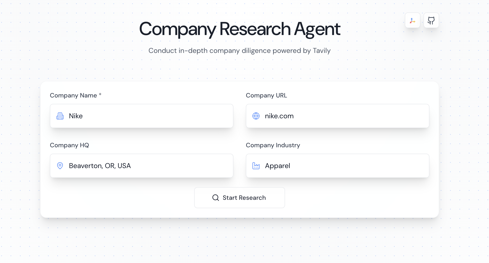
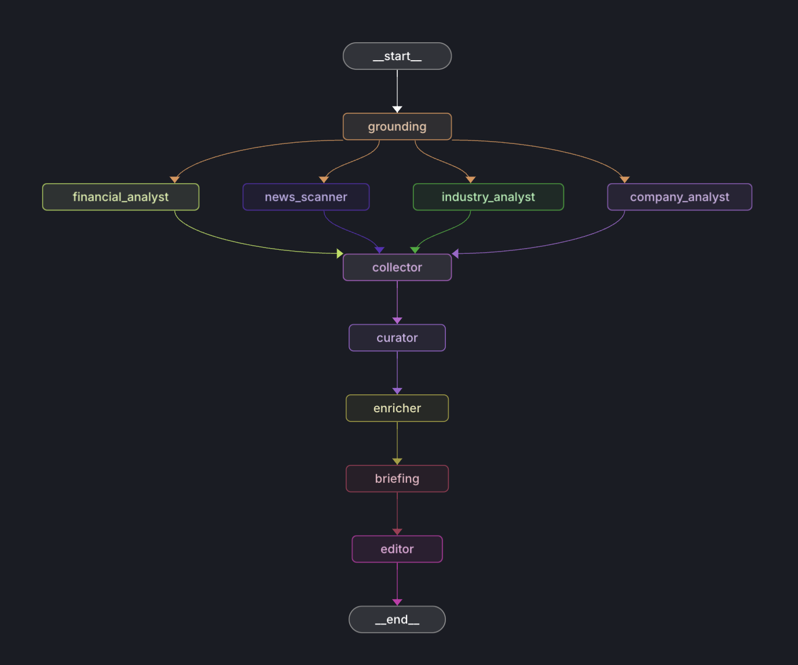
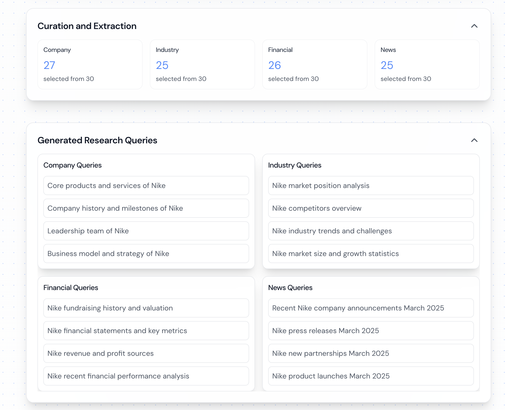

# Agentic Company Researcher 🔍



A multi-agent tool that generates comprehensive company research reports. The platform uses a pipeline of AI agents to gather, curate, and synthesize information about any company.

✨Live Demo: https://app.strategicoverview.net/ ✨

https://github.com/user-attachments/assets/0e373146-26a7-4391-b973-224ded3182a9

## Table of Contents

1. [Objectives](#objectives)
2. [Features](#features)
3. [Live Demo](#live-demo)
4. [Agent Framework](#agent-framework)
5. [API Integration](#api-integration)
6. [Setup](#setup)
7. [Usage](#usage)
8. [Example Outputs](#example-outputs)
9. [Contributing](#contributing)

## Objectives

This project aims to **democratize access to high-quality company intelligence** by automating and accelerating the research process.

1. Automate time-consuming desk research using a network of expert AI agents.
2. Aggregate and filter data from heterogeneous sources to surface trustworthy insights.
3. Produce executive-ready, richly formatted reports in minutes instead of hours.
4. Enable iterative, interactive research where users can refine competitor lists and questions on-the-fly.

## Live Demo

A production deployment is hosted at **[app.strategicoverview.net](https://app.strategicoverview.net/)**.

➜ Open the link, enter a company name (e.g., "Tesla, Inc."), and watch the agents work in real-time. You can download the final report as Markdown or PDF when it completes.

## Features

- **Multi-Source Research**: Gathers data from various sources including company websites, news articles, financial reports, and industry analyses
- **AI-Powered Content Filtering**: Uses Tavily's relevance scoring for content curation
- **Real-Time Progress Streaming**: Uses WebSocket connections to stream research progress and results
- **Dual Model Architecture**:
  - Gemini 2.0 Flash for high-context research synthesis
  - GPT-4.1 for precise report formatting and editing
- **Modern React Frontend**: Responsive UI with real-time updates, progress tracking, and download options
- **Modular Architecture**: Built using a pipeline of specialized research and processing nodes

## Agent Framework

### Research Pipeline

The platform follows an agentic framework with specialized nodes that process data sequentially:

1. **Research Nodes**:

   - `CompanyAnalyzer`: Researches core business information
   - `IndustryAnalyzer`: Analyzes market position and trends
   - `FinancialAnalyst`: Gathers financial metrics and performance data
   - `NewsScanner`: Collects recent news and developments

2. **Processing Nodes**:

   - `Collector`: Aggregates research data from all analyzers
   - `Curator`: Implements content filtering and relevance scoring
   - `Briefing`: Generates category-specific summaries using Gemini 2.0 Flash
   - `Editor`: Compiles and formats the briefings into a final report using GPT-4.1-mini

   

### Content Generation Architecture

The platform leverages separate models for optimal performance:

1. **Gemini 2.0 Flash** (`briefing.py`):

   - Handles high-context research synthesis tasks
   - Excels at processing and summarizing large volumes of data
   - Used for generating initial category briefings
   - Efficient at maintaining context across multiple documents

2. **GPT-4.1 mini** (`editor.py`):
   - Specializes in precise formatting and editing tasks
   - Handles markdown structure and consistency
   - Superior at following exact formatting instructions
   - Used for:
     - Final report compilation
     - Content deduplication
     - Markdown formatting
     - Real-time report streaming

This approach combines Gemini's strength in handling large context windows with GPT-4.1-mini's precision in following specific formatting instructions.

### Content Curation System

The platform uses a content filtering system in `curator.py`:

1. **Relevance Scoring**:

   - Documents are scored by Tavily's AI-powered search
   - A minimum threshold (default 0.4) is required to proceed
   - Scores reflect relevance to the specific research query
   - Higher scores indicate better matches to the research intent

2. **Document Processing**:
   - Content is normalized and cleaned
   - URLs are deduplicated and standardized
   - Documents are sorted by relevance scores
   - Real-time progress updates are sent via WebSocket

### Real-Time Communication System

The platform implements a WebSocket-based real-time communication system:



1. **Backend Implementation**:

   - Uses FastAPI's WebSocket support
   - Maintains persistent connections per research job
   - Sends structured status updates for various events:
     ```python
     await websocket_manager.send_status_update(
         job_id=job_id,
         status="processing",
         message=f"Generating {category} briefing",
         result={
             "step": "Briefing",
             "category": category,
             "total_docs": len(docs)
         }
     )
     ```

2. **Frontend Integration**:

   - React components subscribe to WebSocket updates
   - Updates are processed and displayed in real-time
   - Different UI components handle specific update types:
     - Query generation progress
     - Document curation statistics
     - Briefing completion status
     - Report generation progress

3. **Status Types**:
   - `query_generating`: Real-time query creation updates
   - `document_kept`: Document curation progress
   - `briefing_start/complete`: Briefing generation status
   - `report_chunk`: Streaming report generation
   - `curation_complete`: Final document statistics

## Setup

### Quick Setup (Recommended)

The easiest way to get started is using the setup script, which automatically detects and uses `uv` for faster Python package installation when available:

1. Clone the repository:

```bash
git clone https://github.com/pogjester/tavily-company-research.git
cd tavily-company-research
```

2. Make the setup script executable and run it:

```bash
chmod +x setup.sh
./setup.sh
```

The setup script will:

- Detect and use `uv` for faster Python package installation (if available)
- Check for required Python and Node.js versions
- Optionally create a Python virtual environment (recommended)
- Install all dependencies (Python and Node.js)
- Guide you through setting up your environment variables
- Optionally start both backend and frontend servers

> **💡 Pro Tip**: Install [uv](https://github.com/astral-sh/uv) for significantly faster Python package installation:
>
> ```bash
> curl -LsSf https://astral.sh/uv/install.sh | sh
> ```

You'll need the following API keys ready:

- Tavily API Key
- Google Gemini API Key
- OpenAI API Key
- Google Maps API Key
- MongoDB URI (optional)

### Manual Setup

If you prefer to set up manually, follow these steps:

1. Clone the repository:

```bash
git clone https://github.com/pogjester/tavily-company-research.git
cd tavily-company-research
```

2. Install backend dependencies:

```bash
# Optional: Create and activate virtual environment
# With uv (faster - recommended if available):
uv venv .venv
source .venv/bin/activate

# Or with standard Python:
# python -m venv .venv
# source .venv/bin/activate

# Install Python dependencies
# With uv (faster):
uv pip install -r requirements.txt

# Or with pip:
# pip install -r requirements.txt
```

3. Install frontend dependencies:

```bash
cd ui
npm install
```

4. **Set up Environment Variables**:

This project requires two separate `.env` files for the backend and frontend.

**For the Backend:**

Create a `.env` file in the project's root directory and add your backend API keys:

```env
TAVILY_API_KEY=your_tavily_key
GEMINI_API_KEY=your_gemini_key
OPENAI_API_KEY=your_openai_key

# Optional: Enable MongoDB persistence
# MONGODB_URI=your_mongodb_connection_string
```

**For the Frontend:**

Create a `.env` file inside the `ui` directory. You can copy the example file first:

```bash
cp ui/.env.development.example ui/.env
```

Then, open `ui/.env` and add your frontend environment variables:

```env
VITE_API_URL=http://localhost:8000
VITE_WS_URL=ws://localhost:8000
VITE_GOOGLE_MAPS_API_KEY=your_google_maps_api_key_here
```

### Docker Setup

The application can be run using Docker and Docker Compose:

1. Clone the repository:

```bash
git clone https://github.com/pogjester/tavily-company-research.git
cd tavily-company-research
```

2. **Set up Environment Variables**:

The Docker setup uses two separate `.env` files.

**For the Backend:**

Create a `.env` file in the project's root directory with your backend API keys:

```env
TAVILY_API_KEY=your_tavily_key
GEMINI_API_KEY=your_gemini_key
OPENAI_API_KEY=your_openai_key

# Optional: Enable MongoDB persistence
# MONGODB_URI=your_mongodb_connection_string
```

**For the Frontend:**

Create a `.env` file inside the `ui` directory. You can copy the example file first:

```bash
cp ui/.env.development.example ui/.env
```

Then, open `ui/.env` and add your frontend environment variables:

```env
VITE_API_URL=http://localhost:8000
VITE_WS_URL=ws://localhost:8000
VITE_GOOGLE_MAPS_API_KEY=your_google_maps_api_key_here
```

3. Build and start the containers:

```bash

```

This will start both the backend and frontend services:

- Backend API will be available at `http://localhost:8000`
- Frontend will be available at `http://localhost:5174`

To stop the services:

```bash
docker compose down
```

Note: When updating environment variables in `.env`, you'll need to restart the containers:

```bash
docker compose down && docker compose up
```

### Running the Application

1. Start the backend server (choose one):

```bash
# Option 1: Direct Python Module
python -m application.py

# Option 2: FastAPI with Uvicorn
uvicorn application:app --reload --port 8000
```

2. In a new terminal, start the frontend:

```bash
cd ui
npm run dev
```

3. Access the application at `http://localhost:5173`

## Usage

### Local Development

1. Start the backend server (choose one option):

   **Option 1: Direct Python Module**

   ```bash
   python -m application.py
   ```

   **Option 2: FastAPI with Uvicorn**

   ```bash
   # Install uvicorn if not already installed
   # With uv (faster):
   uv pip install uvicorn
   # Or with pip:
   # pip install uvicorn

   # Run the FastAPI application with hot reload
   uvicorn application:app --reload --port 8000
   ```

   The backend will be available at:

   - API Endpoint: `http://localhost:8000`
   - WebSocket Endpoint: `ws://localhost:8000/research/ws/{job_id}`

2. Start the frontend development server:

   ```bash
   cd ui
   npm run dev
   ```

3. Access the application at `http://localhost:5173`

> **⚡ Performance Note**: If you used `uv` during setup, you'll benefit from significantly faster package installation and dependency resolution. `uv` is a modern Python package manager written in Rust that can be 10-100x faster than pip.

### Deployment Options

The application can be deployed to various cloud platforms. Here are some common options:

#### AWS Elastic Beanstalk

1. Install the EB CLI:

   ```bash
   pip install awsebcli
   ```

2. Initialize EB application:

   ```bash
   eb init -p python-3.11 tavily-research
   ```

3. Create and deploy:
   ```bash
   eb create tavily-research-prod
   ```

#### Other Deployment Options

- **Docker**: The application includes a Dockerfile for containerized deployment
- **Heroku**: Deploy directly from GitHub with the Python buildpack
- **Google Cloud Run**: Suitable for containerized deployment with automatic scaling

Choose the platform that best suits your needs. The application is platform-agnostic and can be hosted anywhere that supports Python web applications.

## API Integration

The backend exposes a concise REST + WebSocket interface. All paths below are relative to your server root (e.g. `http://localhost:8000`).

| Method | Path                           | Payload                                                                                 | Purpose                                                          |
| ------ | ------------------------------ | --------------------------------------------------------------------------------------- | ---------------------------------------------------------------- |
| POST   | `/research`                    | `{ "company": "ACME Corp", "company_url": "https://acme.com", "user_role": "analyst" }` | Kick-off a new research run. Returns `job_id` and WebSocket URL. |
| GET    | `/research/{job_id}`           | —                                                                                       | Retrieve job metadata and status.                                |
| GET    | `/research/{job_id}/report`    | —                                                                                       | Fetch the final Markdown report (once completed).                |
| GET    | `/research/status/{job_id}`    | —                                                                                       | Lightweight status polling endpoint.                             |
| POST   | `/research/competitors/modify` | `{ "job_id": "<job_id>", "competitors": ["Foo Inc", "Bar Ltd"] }`                       | Overwrite the automatically detected competitor list.            |
| POST   | `/generate-pdf`                | `{ "report_content": "<md>", "company_name": "ACME Corp" }`                             | Convert Markdown report to a styled PDF.                         |
| POST   | `/card_chat`                   | `{ "card_context": "...", "question": "Explain ..." }`                                  | One-off Q&A related to a specific research card.                 |

### WebSocket

```
ws://<host>/research/ws/{job_id}
```

The WebSocket streams structured JSON updates, for example:

```json
{
  "status": "processing",
  "step": "Briefing",
  "category": "Financials",
  "progress": 0.42,
  "message": "Generating Financials briefing"
}
```

Refer to `backend/services/websocket_manager.py` for the full schema.

## Example Outputs

A complete sample report for Apple Inc. is included in [`generated_comprehensive_report.md`](generated_comprehensive_report.md).


```md
### Executive Summary

Apple Inc. (NASDAQ: AAPL) is a leading global technology company...
```

You can also download PDF versions via the **Download PDF** button in the UI.

## Contributing

1. Fork the repository
2. Create a feature branch (`git checkout -b feature/amazing-feature`)
3. Commit your changes (`git commit -m 'Add amazing feature'`)
4. Push to the branch (`git push origin feature/amazing-feature`)
5. Open a Pull Request

## License

This project is licensed under the MIT License - see the [LICENSE](LICENSE) file for details.

## Acknowledgments

- [Tavily](https://tavily.com/) for the research API
- All other open-source libraries and their contributors
