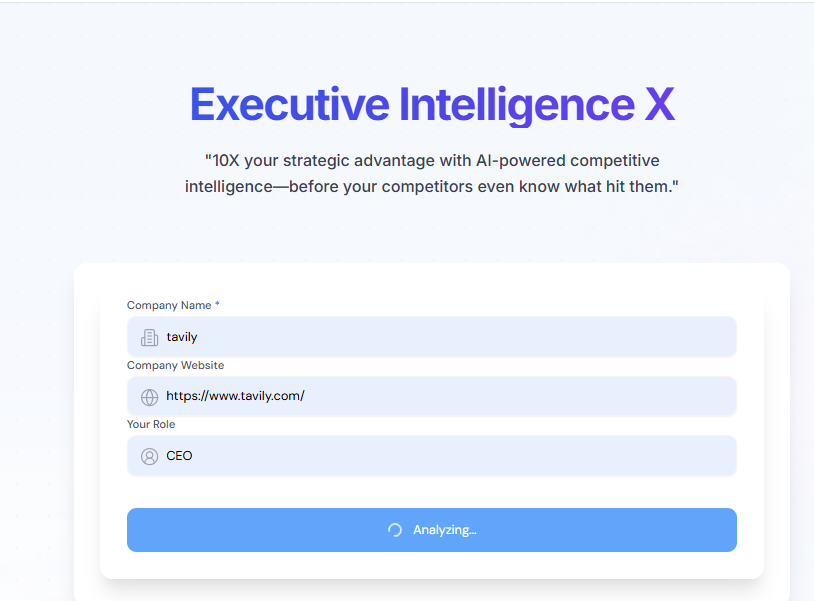
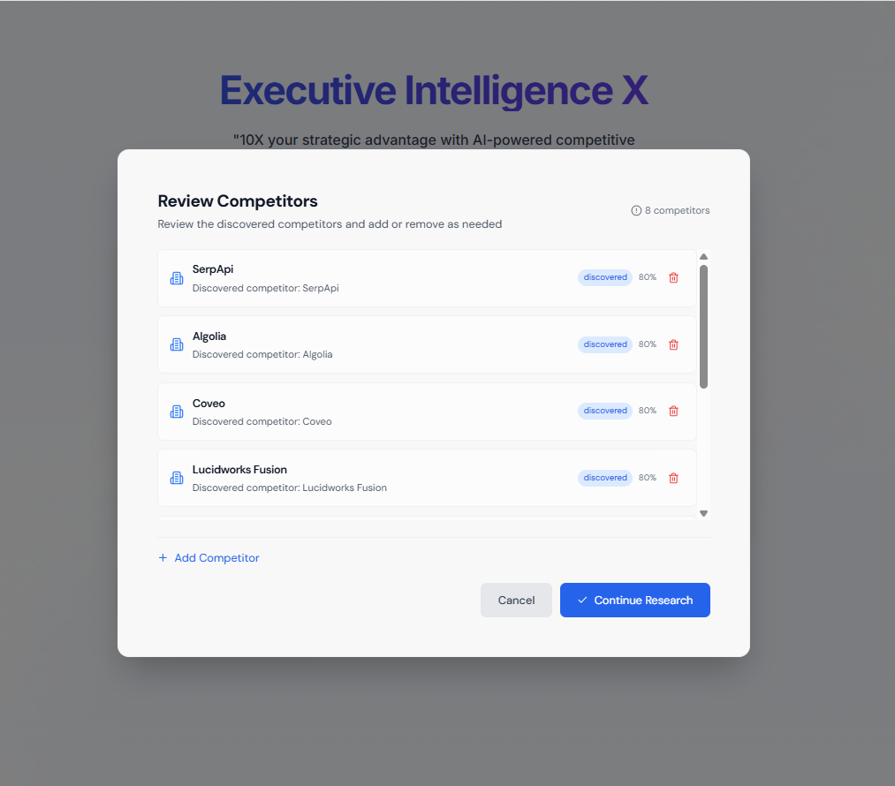
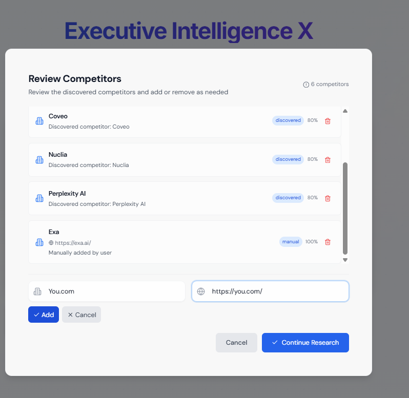

# Company Research Agent - User Guide

Welcome to the Company Research Agent! This tool helps you automatically discover competitors, analyze market trends, and generate comprehensive research reports about your company and its competitive landscape.

## Getting Started

### System Overview

The Company Research Agent is an AI-powered tool that:

- Automatically discovers your company's competitors
- Analyzes market trends and competitive positioning
- Generates detailed research reports with insights and recommendations
- Provides downloadable PDF reports for easy sharing

## Step-by-Step Usage Guide

### Step 1: Enter Your Company Information

1. Navigate to the main page of the application
2. Fill out the research form with your company details:
   - **Company Name** (required) - Enter your company's full name
   - **Company Website** (optional) - Your company's website URL for better analysis
   - **Your Role** (optional) - Your position/role for context

3. Click the **"Start Analysis"** button to begin the research process

### Step 2: Competitor Discovery Phase

Once you start the analysis, the system will:

- Automatically search for and identify potential competitors
- Use AI to analyze your company's industry and market space
- Display real-time progress updates showing the discovery process
- This phase typically takes 2-3 minutes

**What's happening during this phase:**

- Industry classification and analysis
- Web scraping and data collection
- AI-powered competitor identification
- Initial market landscape mapping

### Step 3: Review and Customize Competitors

After the discovery phase, you'll see the **Competitor Review** dialog where you can:

#### Removing Competitors

- Review the automatically discovered competitors
- Remove any irrelevant competitors by clicking the **trash icon (🗑️)** next to their name
- This helps focus the analysis on your most relevant competition

#### Adding Competitors

- Click the **"Add Competitor"** button to manually add competitors
- Enter the competitor's name and website URL
- This is useful for including competitors the system might have missed

#### Finalizing Your Competitor List

- Review your final list to ensure it includes your key competitors
- Click **"Confirm and Continue"** when you're satisfied with the selection
- The system will use this curated list for the comprehensive analysis

### Step 4: Comprehensive Analysis and Report Generation

After confirming your competitors, the system will:

- Conduct deep analysis of each competitor
- Research market trends and industry insights
- Analyze competitive positioning and strengths/weaknesses
- Generate strategic recommendations
- Compile everything into a comprehensive report

**This phase includes:**

- Competitor profile analysis
- Market trend research
- SWOT analysis
- Strategic positioning insights
- Industry landscape mapping

**Timeline:** This comprehensive analysis typically takes 5-10 minutes, depending on the number of competitors and complexity of your industry.

### Step 5: Accessing Your Research Report

Once the analysis is complete:

1. **View Online Report**: Review the comprehensive report directly in your browser
2. **Download PDF**: Click the **"PDF"** button to download a professionally formatted report
3. **Report Contents**: Your report will include:
   - Executive summary
   - Competitor profiles and analysis
   - Market trend insights
   - Strategic recommendations
   - Industry landscape overview

The PDF file will be automatically named after your company (e.g., "Apple Inc.pdf") and downloaded to your default download folder.

## Tips for Best Results

### Company Information

- **Use full company names** for better competitor discovery
- **Include website URLs** when possible for more accurate analysis
- **Be specific about your role** to get more targeted insights

### Competitor Review

- **Quality over quantity**: Focus on your most direct competitors rather than including too many
- **Include major players**: Don't forget industry leaders even if they're much larger
- **Consider niche competitors**: Include specialized competitors in your specific market segment

### Report Usage

- **Share with stakeholders**: The PDF format makes it easy to share with team members
- **Regular updates**: Run new analyses periodically to track competitive changes
- **Strategic planning**: Use insights for strategic planning and market positioning

## Troubleshooting

### Common Issues

**Analysis takes too long:**

- Check your internet connection
- Ensure you haven't included too many competitors (recommended: 5-10)
- Try refreshing the page and starting over

**Poor competitor discovery:**

- Make sure your company name is spelled correctly
- Include your company website for better context
- Manually add known competitors during the review phase

**Report generation fails:**

- Check that you have at least 2-3 confirmed competitors
- Ensure your company information is complete and accurate
- Try reducing the number of competitors and running again
